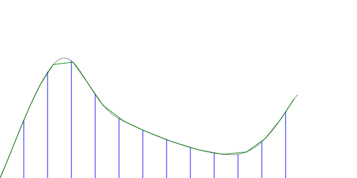

# npmcad-resample

take a line (an array of vertices) and return a resampled at fixed steps along the line or an axis.

## visualize

The grey curve is generated with [cardinal-spline-js](http://npm.im/cardinal-spline-js),
the blue lines point to output of `resample.steps` and the green shows a `resample.along` line.

## api

## resample.steps (points, step)

resample a curve at even steps perpendicular to a vector.

step should be a [csg](https://github.com/jscad/csg.js)  Vector3D instance.
points should be an array of Vector3D points, that define a curve you want to resample.
The curve must not have more than one intersection on any plane perpendicular to a line
through the first point in the direction of `step`. That is, if `points` is a mountain
range and `step` points along the foot of the mountians (along the horizon) then
the mountains can have steep cliffs but not fully vertical or caves or overhangs.

## resample.along (points, size)

resample a curve at fixed size steps along it's own length. in this case,
overhangs and caves are supported.

## License

MIT

